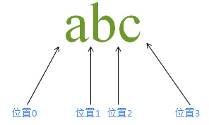

> 学习资料：
>
> + [Java API学习教程之正则表达式详解](https://www.jb51.net/article/118773.htm)
> + [正则表达式学习教程](https://blog.csdn.net/lxcnn)
>   + [正则基础之——NFA引擎匹配原理](https://blog.csdn.net/lxcnn/article/details/4304651)
>   + [正则基础之——环视](https://blog.csdn.net/lxcnn/article/details/4304754)
> + 

# RegExp

> 正则表达式学习

## JAVA中如何使用正则表达式

### matches

> 匹配正则表达式，整个字符串满足表达式的要求才算匹配成功，匹配成功返回`true`，否则返回`false`

+ 方法1

  ```java
  String str = "I am noob from runoob.com.";
  String regExp = ".*runoob.*";
  
  boolean isMatch = Pattern.matches(regExp, str);
  System.out.println("字符串中是否包含了 'runoob' 子字符串? " + isMatch);
  ```

+ 方法2

  ```java
  String str = "I am noob from runoob.com.";
  String regExp = ".*runoob.*";
  
  Pattern pattern = Pattern.compile(regExp);
  Matcher matcher = pattern.matcher(str);
  boolean isMatch= matcher.matches();
  System.out.println("字符串中是否包含了 'runoob' 子字符串? " + isMatch);
  ```

+ 方法3

  ```java
  @Test
  public void matchesMethodTest3(){
      boolean isMatch = "I am noob from runoob.com.".matches(".*runoob.*");
      System.out.println("字符串中是否包含了 'runoob' 子字符串? " + isMatch);
  }
  ```

### split

> 按照正则表达式的规则对字符串进行分割

+ 方法1

  ```Java
  @Test
  public void splitMethodTest1(){
  // 使用1个或多个","、" "或"|"分割字符串
  Pattern pattern = Pattern.compile("[, |]+");
  String[] strs = pattern.split("Java    Hello World Java,Hello,,World|Sun");
  System.out.println(Arrays.asList(strs));
  }
  ```

+ 方法2

  ```java
  @Test
  public void splitMethodTest2(){
      // 使用1个或多个","、" "或"|"分割字符串
      String[] split = "Java    Hello World Java,Hello,,World|Sun".split("[, |]+");
      System.out.println(Arrays.asList(split));
  }
  ```

### find、group、start、end

> `find`：查找下一个匹配到的字符串，成功返回`true`，否则返回`false`
>
> `group`：返回匹配到的字符串
>
> `start`：返回匹配到的字符串在原字符串中的索引
>
> `end`：返回匹配到的字符串的最后1个字母在原字符串中的索引

```java
String str = "I am noob from runoob.com.";
String regExp = "\\S*noob\\S*";

Pattern pattern = Pattern.compile(regExp);
Matcher matcher = pattern.matcher(str);
// 查找下一个匹配到的字符串，匹配到返回true，否则返回false
while (matcher.find()){
    // 返回匹配到的字符串
    System.out.println(matcher.group());
    // 返回匹配到的字符串在原字符串中的索引
    System.out.println(matcher.start());
    // 返回匹配到的字符串的最后1个字母在原字符串中的索引
    System.out.println(matcher.end());
}
```

### replaceFirst、replaceAll

> `replaceFirst`：替换第1个匹配到的子字符串
>
> `replaceAll`：替换全部匹配到的子字符串

+ 方法1

  ```java
  Pattern pattern = Pattern.compile("正则表达式");
  Matcher matcher = pattern.matcher("正则表达式 Hello World,正则表达式 Hello World");
  //替换第一个
  System.out.println(matcher.replaceFirst("Java"));
  //替换全部
  System.out.println(matcher.replaceAll("Java"));
  ```

+ 方法2

  ```java
  //替换第一个
  String s = "正则表达式 Hello World,正则表达式 Hello World".replaceFirst("正则表达式", "java");
  System.out.println(s);
  //替换全部
  s = "正则表达式 Hello World,正则表达式 Hello World".replaceAll("正则表达式", "java");
  System.out.println(s);
  ```

  

### appendReplacement、appendTail

> `appendReplacement`：将当前匹配子串替换为指定字符串，并且将替换后的子串以及其之前到上次匹配子串之后的字符串段添加到一个 StringBuffer 对象里
>
> `appendTail`：将最后一次匹配工作后剩余的字符串添加到一个 StringBuffer 对象里

```java
// 逐个替换字符串中匹配到的多个子字符串
Pattern pattern = Pattern.compile("正则表达式");
Matcher matcher = pattern.matcher("正则表达式 Hello World,正则表达式 Hello World ");
StringBuffer sbr = new StringBuffer();
while (matcher.find()) {
    /*
        将当前匹配子串替换为指定字符串，并且将替换后的子串以及其之前到上次匹配子串之后的
        字符串段添加到一个 StringBuffer 对象里
    */
    matcher.appendReplacement(sbr, "Java");
}
// 将最后一次匹配工作后剩余的字符串添加到一个 StringBuffer 对象里
matcher.appendTail(sbr);
System.out.println(sbr.toString());
```

## 正则表达式基础

### 普通字符表示

+ 普通字符

  > `s`、`i`、`e`等

+ 八进制数

  > 以`\\0`开头，后面紧跟1-3位数字

+ 十六进制数

  > 以`\\x`或`\\X`开头，后面紧跟2位数

+ Unicode编码

  > 以`\\u`开头，后面紧跟4位数

### 双斜杠与单斜杠区别

> 在java中，正则表达式的特殊字符，使用`\\`，如`\\d`、`\\s`等；
>
> 普通的转义字符使用`\`，如`\r`、`\n`

### 字符组

> + `[...]`表示字符组
> + 字符数组表示匹配字符组中的任意1个字符

1. `[single]`表示匹配`s`、`i`、`n`、`g`、`l`、`e`中的任意1个字符

2. `-`表示范围

   + `[0123456789]`可以表示为`[0-9]`
   + `-`出现在两个字符之间才有特殊意义，否则表示普通字符`-`

3. `^`在字符组中表示排除

   + `[^0123]表示`匹配除`0123`以外的字符

   + `^`出现在字符组的最前面才具有排除的意义，否则表示普通字符

     > `[c^y]`表示匹配`c`、`^`、`y`

4. 字符组嵌套

   > + `[0-9[a-z]]`的形式就是字符组嵌套，可以理解为多个字符组之间使用使用`或`关系连接，即匹配多个字符组中任意1个字符
   >
   > + 字符组嵌套可以表示为另外1种形式
   >
   >   `[0-9[a-z]]`可以表示为`[0-9a-z]`

5. 字符组`与`

   > + `[0-9&&[^5]]`就是字符组之间`与`关系的表现形式，表示匹配`0-9`中的任意1个字符，并且不匹配`5`
   >
   > + `[0-9&&[a-z]]`
   >
   >   这是1个逻辑上存在错误的表达式，语法上表示匹配属于`0-9`并且属于`a-z`的字符，实际上并不存在这样的字符

6. 预定义字符组

   + `\\d`：等同于`[0-9]`，表示任意1个数字字符
   + `\\D`：等同于`[^0-9]`，表示任意1个非数字字符
   + `\\w`：等同于`[0-9a-zA-Z]`,表示任意1个word（单词字符）
   + `\\W`：等同于`[^0-9a-zA-Z]`，表示任意1个非单词字符
   + `\\s`：等同于`[\t\n\x0B\f\r]`，匹配的是1个空格字符
   + `\\S`：等同于`[^\t\n\x0B\f\r]`，匹配1个空格字符
   + `.`：除了不匹配换行，能匹配任意字符

### 字符出现次数量词

> 以下符号也称作`匹配优先量词`

+ `+`
  + 指定位于元字符前面的普通字符可以出现一次或者多次
  + 例：`se+cyy`可以匹配`secyy`、`seeeecyy`，但是不能匹配`scyy`
+ `*`
  + 指定位于元字符前面的普通字符可以出现0次或者多次
  + 例：`se+cyy`可以匹配`secyy`、`seeeecyy`、`scyy`
+ `?`
  - 指定位于元字符前面的普通字符可以出现0次或者1次
  - 例：`se+cyy`可以匹配`secyy`、`scyy`，但是不能匹配`seeecyy`
+ `{m,n}`
  + 指定位于元字符前面的普通字符可以出现m-n次
  + 例：
    + `se{3,4}cyy`可以`e`出现3到4次
    + `se{5}cyy`只能匹配`e`出现5次
    + `se{2,}cyy`可以匹配`e`出现2次或多次

### 分组

1. 字符串匹配

   > - 前面控制出现次数的字符都是单独的字符，如果要控制字符串的出现次数，则需要使用分组
   > - 我们用`()`表示分组
   > - 分组是有编号的，第一个分组编号为1，0代表整个表达式本身

   例：

   + `sing(le)*ccc`中，`le`可以出现0次或多次

2. 字符串组

   > + 结合`|`，可以实现和字符组一样的效果

   例：`(happy|sad|cry)`可以匹配三个子字符串`happy`、`sad`、`cry`

3. 分组编号

   + 作用

     > + 分组编号用于重新捕获和使用分组内==匹配到的内容==，每个分组按照出现的次序从1开始递增
     > + 使用`\\分组编号`对分组进行引用

     例：

     + `<(\\w+)>(.*)</\\1>`可以匹配`<hearder>hello</header>`，但是不能匹配`<hearder>hello</headersss>`
     + 注意：
       + `<(\\w+)>(.*)</\\1>`不等效于`<(\\w+)>(.*)</\\w+>`，引用分组时使用的不是分组内得表达式，而是分组内表达式匹配到的内容
       + `<(\\w+)>(.*)</\\w+>`可以匹配`<hearder>hello</header>`，也可以匹配`<hearder>hello</headersss>`

   + 分组命名

     > + 如果不想使用分组编号，也可以为分组重命名
     > + 分组命名语法：`(?<name>X)`
     >   + 其中`?`和`<>`为命名分组时固定的语法
     >   + `name`是为分组命名的名称
     >   + `X`为分组内的表达式
     > + 引用命名分组语法：`\\k<name>`
     >   + 其中`\\k<>`为引用命名分组的固定语法
     >   + `name`为分组名称

     例：`<(?<group1>\\w+)>(.*)</\\k<group1>>`等效于`<(\\w+)>(.*)</\\1>`

### 边界匹配

#### `^`与`#### 

> - 单行模式下
>
>   `^`：匹配整个输入字符串的首部位置边界
>
>   `$`：匹配整个输入字符串的尾部位置边界，如果字符串以指定字符，或指定字符加上`终止子`结尾，都是可以匹配的
>
> - 多行模式下
>
>   `^`：匹配一行的首部位置边界
>
>   `$`：匹配一行的尾部位置边界，如果该行以指定字符，或指定字符加上`终止子`结尾，都是可以匹配的

例：

```java
Pattern pattern = Pattern.compile("(?m)^Google$");
Matcher matcher = pattern.matcher("Google\rGoogle");
while (matcher.find()){
    System.out.println(matcher.group());
}
```

+ 作用

  例：

  ```java
  Pattern pattern = Pattern.compile("^a\\d?b");
  //Pattern pattern = Pattern.compile("a\\d?b");
  Matcher matcher = pattern.matcher("a1ba2baba33b");
  while (matcher.find()){
      System.out.println("["+matcher.group()+"]");
  }
  ```

  > 上面代码中，使用`^a\\d?b`只能匹配到`a1b`；而`a\\d?b`可以匹配到`a1b`、`a2b`、`ab`

#### 终止子

> 终止子就是1行的终止字符，包括如下几种：
>
> + `\n`
> + `\r`
> + `\r\n`
> + `\u0085`
> + `\u2028`
> + `\u2029`

#### 单行模式和多行模式

1. 设置模式

   > 在执行`Pattern`类的`compile`方法时，可以指定使用`单行模式`还是`多行模式`，指定方法有2种

   ```java
   // 单行模式
   Pattern pattern0 = Pattern.compile("(?s)^Google$");
   // 或
   Pattern pattern1 = Pattern.compile("^Google$",Pattern.DOTALL);
   
   // 多行模式
   Pattern pattern2 = Pattern.compile("(?m)^Google$");
   // 或
   Pattern pattern3 = Pattern.compile("^Google$",Pattern.MULTILINE);
   ```

2. 区别

   + 单行模式

     该模式下不识别`终止子`，`终止子`被当做普通字符串处理

   + 多行模式

     该模式下识别`终止子`，表达式会根据当前模式对`终止子`做不同的处理

#### `\\A`、`\\z`、`\\Z`

1. 介绍

   > - `\\A`：
   >   - 匹配整个输入字符串的首部位置边界，不区分`单行模式`、`多行模式`
   >   - 等同于`单行模式`下的`^`
   > - `\\z`：
   >   - 匹配整个输入字符串的尾部位置边界，只能匹配以指定字符结尾的字符串，不能匹配指定字符串加上终止子结尾的字符串
   > - `\\Z`：
   >   - 匹配整个输入字符串的尾部位置边界，如果字符串以指定字符，或指定字符加上`终止子`结尾，都是可以匹配的
   >   - 等同于单行模式下的`$`

2. `\\z`与`\\Z`区别

   ```java
   Input: "Google"       Regex: "\\AGoogle\\z"     匹配到: "Google\nApple"
   Input: "Google\n"     Regex: "\\AGoogle\\z"     匹配到: 无
   Input: "Google"       Regex: "\\AGoogle\\Z"     匹配到: "Google\nApple"
   Input: "Google\n"     Regex: "\\AGoogle\\Z"     匹配到: "Google\nApple"
   ```

3. 注意

   > `$`、`\\z`、`\\Z`在`终止子`上的区别，要使用`group`方法进行验证，使用`matches`方法验证时，结尾多出`终止子`时，都是匹配不到的（==TODO==）

   ```java
   System.out.println("---------------- $ -----------------");
   Pattern pattern = Pattern.compile("^Google$");
   Matcher matcher = pattern.matcher("Google\n");
   System.out.println(matcher.matches());
   while (matcher.find()){
       System.out.println("$："+matcher.group());
   }
   
   System.out.println("---------------- z -----------------");
   pattern = Pattern.compile("\\AGoogle\\z");
   matcher = pattern.matcher("Google\n");
   System.out.println(matcher.matches());
   while (matcher.find()){
       System.out.println("z："+matcher.group());
   }
   
   System.out.println("---------------- Z -----------------");
   pattern = Pattern.compile("\\AGoogle\\Z");
   matcher = pattern.matcher("Google\n");
   System.out.println(matcher.matches());
   while (matcher.find()){
       System.out.println("Z ："+matcher.group());
   }
   
   /*
         ---------------- $ -----------------
         false
         $：Google
         ---------------- z -----------------
         false
         ---------------- Z -----------------
         false
         Z ：Google
   */
   ```

#### `\b`与`\B`

> + `\b`：单词边界
> + `\B`：非单词边界
> + 这里`单词`、`边界`的意义还没完全弄清楚，使用不同方法时，意义不太一样，以后再深入研究（==TODO==）

例1：

```java
Pattern pattern = Pattern.compile("\\b\\w*e\\w*\\b");
Matcher matcher = pattern.matcher(" Google google");
while (matcher.find()){
    System.out.println("["+matcher.group()+"]");
}
/*
    [Google]
    [google]
*/

pattern = Pattern.compile("\\b.*\\b");
matcher = pattern.matcher(" Google google");
while (matcher.find()){
    System.out.println("["+matcher.group()+"]");
}
/*
    [Google google]
    []
*/
```

例2：

```java
Pattern pattern = Pattern.compile("\\b");
Matcher matcher = pattern.matcher(" Google?？你好abc\n");
String [] result=pattern.split(" Google?？你好abc12\n");

for(String string:result){
    System.out.println("["+string+"]");
}
/*
    [ ]
    [Google]
    [?？]
    [你好abc12]
    [
    ]
*/
```

## 匹配原理

### 预备知识

#### 字符串组成



> 对于字符串“**abc**”而言，包括三个字符和四个位置

#### 占有字符、零宽度

+ 占有字符

  如果子表达式匹配到的是字符内容，而非位置，并被保存到最终的匹配结果中，那么就认为这个子表达式是占有字符的

+ 零宽度

  如果子表达式匹配的仅仅是位置（如`^`），或者匹配的内容并不保存到最终的匹配结果中（如`环视表达式`），那么就认为这个子表达式是零宽度的。

+ 例如

  > 表达式：*^(?![0-9])***[a-z0-9]+***$*
  >
  > 该表达式中，斜体部分是零宽度的，粗体部分是占有字符的

+ 互斥

  + 占有字符的表达式之间是互斥的

    匹配过程中的任意时刻，1个字符只能由1个子表达式成功匹配过

  + 零宽度的表达式之间，或零宽度的表达式与占有字符的表达式之间是非互斥的

    匹配过程中的任意时刻，1个字符可以由多个子表达式成功匹配过

#### 控制权、备选方案、回溯、传动

+ 控制权

  + 匹配过程中，轮到哪个子表达式对某个字符进行匹配了，就称该子表达式拥有对该字符的控制权

  + 例

    表达式`\\d?[a-z]+`在匹配`abcde`时，子表达式`\\d?`先拥有字符`a`的`控制权`，对其进行匹配，匹配失败后子表达式`[a-z]+`拥有字符`a`的`控制权`，对其进行匹配

+ 备选方案

  + 匹配过程中，1个子表达式对某个字符进行匹配时，如果有多种结果可以使匹配继续向下进行，则认为这些多种结果中不是优先进行的那几种结果是备选方案

  + 例

    表达式`\\d?[a-z]+`在匹配`abcde`时，与`\\d?`进行匹配的字符，是数字可以继续向下匹配，如果不是数字也可以继续向下匹配，由下1个子表达式对其进行匹配，后面这种情况就是1种备选方案

+ 回溯

  + 匹配过程中，如果当前子表达式对当前字符进行匹配失败了，并且没有备选方案可以选择时，可以回退到上1个被匹配的字符，看他有没有备选方案可以选择，这个回退的过程称之为`回溯`

  + 例

    表达式`\\w*\\d`在匹配`1234;`时，`\\w*`先匹配到`1234`，而继续向下匹配时，`\\d`与`;`匹配失败了，此时会回退到上一次匹配，选择`\\w*`的备选方案，尝试让他匹配到`123`，让`\\d`匹配到`4`，这个回退的过程就是`回溯`

+ 传动

  + 匹配过程中，表达式会从字符串的第1个字符开始匹配，如果本轮匹配没有成功，会一直回溯到表达式的第1个子表达式，从字符串的第2个字符开始下一轮匹配，这个从下一个字符开始下一轮匹配的过程叫做`传动`

  + 例

    表达式`\\d[a-z]`在匹配`12a`时,第一轮：`\\d`匹配到字符串第1个字符`1`，而`2`匹配`[a-z]`时匹配失败，回溯到上一次匹配，而`\\d`匹配`1`没有备选方案，此时已经到了表达式的开头，第1轮匹配结束；现在开始第2轮匹配，让`\\d`匹配字符串的第2个字符`2`，`[a-z]`匹配到`a`，本轮匹配成功；这个上一轮匹配失败，从下一个字符串开始第2轮匹配的过程就是`传动`

### 匹配过程

> 表达式在匹配字符串过程中，是从左往右进行匹配的，所以越左侧的表达式越先进行匹配，优先级越高

#### 简单匹配

> 简单匹配过程参见[正则基础之——NFA引擎匹配原理](https://blog.csdn.net/lxcnn/article/details/4304651)

#### 环视匹配

##### 顺序环视

> + 表达式：`\\w*(?=\\d)`
>
> + 字符串：`abcde1a`
>
> + 原则
>
>   顺序环视表达式匹配的是当前位置右侧的字符，其右侧字符串前面的一段字符串能够匹配到环视表达式就算匹配成功,不用完全匹配
>
> + 匹配过程
>
>   开始匹配后，`\\w*`匹配到`abcde1a`，而后面没有字符了，跟`\\d`匹配失败，此时需要回溯
>
>   回溯后`\\w*`匹配到`abcde1`，`\\d`与`a`匹配失败，此时需要回溯
>
>   回溯后`\\w*`匹配到`abcde`，`\\d`与`1`匹配成功，匹配结束
>
>   而环视表达式匹配到的内容不会保存到最终的结果中，所以匹配结果为`abcde`

##### 逆序环视

> + 表达式：`\\w*(?<=\\d)`
>
> + 字符串：`abcde1a`
>
> + 原则
>
>   + 逆序环视表达式匹配的是当前位置左侧的字符，其左侧字符串后面的一段字符串能够匹配到环视表达式就算匹配成功,不用完全匹配
>   + 逆序环视表达式中不允许使用`匹配优先量词`
>
> + 匹配过程
>
>   开始匹配后，`\\w*`匹配到`abcde1a`，当前处于结束位置，其左边的`\\d`与`a`匹配失败，此时需要回溯
>
>   回溯后`\\w*`匹配到`abcde1`，当前处于`1`后面的位置，`\\d`与`1`匹配成功，匹配结束
>
>   所以匹配结果为`abcde1`

## 环视

> `(?=...)`是不消耗字符的表达式

1. 肯定顺序环视

   + 语法：`(?=...)`

   + 功能：

     + 在满足其左侧表达式的前提下，当前位置右侧的字符满足环视表达式才继续向下匹配，否则匹配失败

   + 例：

     > + 表达式：`(?=.*\\d)\\w*`
     > + 字符串：`abcde1a`
     > + 解析：该表达式首先匹配环视表达式，环视表达式表示右侧字符串含有数字就可以，找到其右侧字符串包含数字的位置，然后匹配其右侧的所有数字或字母字符串

     

2. 否定顺序环视

   + 语法：`(?!...)`

   + 功能：

     + 在满足其左侧表达式的前提下，当前位置右侧的字符不满足环视表达式才继续向下匹配，否则匹配失败

   + 例：

     > - 表达式：`^(?!.*\\d)\\w*`
     > - 字符串：`abcdea`
     > - 解析：该表达式首先匹配`^`，然后匹配环视表达式，环视表达式表示右侧字符串不能含有数字，`^`与环视表达式共同作用，表示整个字符串不能含有数字，才能继续向下匹配，然后提取开头开始的所有数字和字母字符串

3. 肯定逆序环视

   + 语法：`(?<=...)`

   + 功能：

     + 在满足其左侧表达式的前提下，当前位置左侧的字符满足环视表达式才继续向下匹配，否则匹配失败
     + 逆序环视表达式中不能使用`匹配优先量词`

   + 例：

     > - 表达式：`\\w*(?<=\\d)`
     > - 字符串：`abcde1a`
     > - 解析：该表达式首先匹配`\\w*`，然后匹配环视表达式，环视表达式表示左侧字符串的最后1个字符必须为数字，环视表达式匹配到的是`1`后面的位置，`\\w*`匹配到`1`及其左面的数字或字母字符串

4. 否定逆序环视

   + 语法：`(?<!...)`

   + 功能：

     + 在满足其左侧表达式的前提下，当前位置左侧的字符不满足环视表达式才继续向下匹配，否则匹配失败
     + 逆序环视表达式中不能使用`匹配优先量词`

   + 例：

     > - 表达式：`[a-zA-Z]*(?<!\\d)`
     >
     > - 字符串：`abcde1a`
     >
     > - 解析：该表达式首先匹配`[a-zA-Z]*`，首先匹配到`abcde`，位置在`e`右侧位置，此时开始匹配环视表达式，环视表达式表示其左侧字符不能是数字，而`e`满足环视表达式，所以整个表达式先匹配到`abcde`；`[a-zA-Z]*`再次匹配`1a`，匹配失败，接着向下匹配，位置移动到`1`右侧，`[a-zA-Z]*`匹配`a`成功，位置移动到`a`右侧，`a`满足环视表达式，匹配成功。
     >
     >   所以该表达式匹配该字符串共匹配到两个字符串`abcde`和`a`

## 贪婪

1. 贪婪匹配与非贪婪匹配

   + 贪婪匹配

     + 功能：默认模式下，正则表达式趋向于最大长度匹配，也就是贪婪匹配。

     + 如：

       >+ 表达式：`\\w*(?=\\d)`
       >+ 字符串：`a1b2c3d`
       >+ 解释：
       >  + `\\w*`默认是贪婪匹配，优先匹配到`a1b2c3d`，此时位置在`d`右侧，后面没有字符了，匹配环视表达式失败，需要回溯
       >  + 回溯后`\\w*`匹配到`a1b2c3`，此时位置在`3`右侧，后面`d`匹配环视表达式失败，需要回溯
       >  + 回溯后`\\w*`匹配到`a1b2c`，此时位置在`c`右侧，后面`3`匹配环视表达式成功
       >  + 所以匹配结果为`a1b2c`

   + 非贪婪匹配

     + 语法：`匹配优先量词`后加上`?`

     + 功能：非贪婪匹配模式下，正则表达式趋向于最小长度匹配

     + 如：

       > - 表达式：`\\w*?(?=\\d)`
       > - 字符串：`a1b2c3d`
       > - 解释：
       >   - `\\w*?`是非贪婪匹配，优先匹配到`a`，此时位置在`a`右侧，`1`匹配环视表达式成功，本轮整个表达式匹配结果为`a`
       >   - 接着向下匹配，`\\w*?`匹配到`1`，此时位置在`1`右侧，`b`匹配环视表达式失败；位置右移，`\\w*?`匹配到`b`,此时位置在`b`右侧，`2`匹配环视表达式成功，本轮整个表达式匹配结果为`b`
       >   - 接着向下匹配，`\\w*?`匹配到`2`，此时位置在`2`右侧，`c`匹配环视表达式失败；位置右移，`\\w*?`匹配到`c`,此时位置在`c`右侧，`3`匹配环视表达式成功，本轮整个表达式匹配结果为`c`
       >   - 所以匹配结果为`a`、`b`、`c`

     


